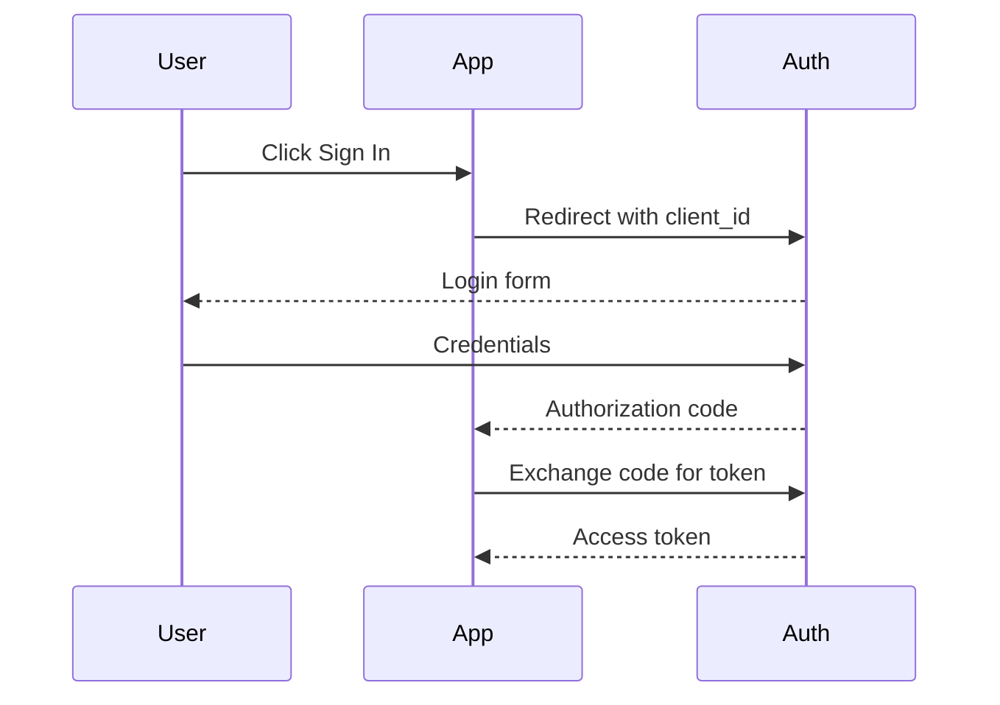

# Building an AI-Integrated Smart Whiteboard

A complete, end-to-end guide for designing, assembling, and programming a smart whiteboard that recognizes handwriting, understands speech, generates diagrams, and collaborates with users through a large language model.

---

## 1. Overview

An AI-integrated smart whiteboard is a wall-mounted (or portable) interactive surface that captures pen and finger input, listens to voice commands, displays computer-generated content, and uses artificial intelligence to interpret, summarize, translate, or expand on what is written. The board behaves like a hybrid between a traditional dry-erase board, a tablet, and a conversational AI assistant.

This guide walks through the full build in three layers:

1. **Hardware** — the physical board, sensors, display, and compute.
2. **Software** — the operating system, drivers, and whiteboard application.
3. **AI services** — handwriting recognition, speech recognition, vision, and large-language-model integration.

Estimated build time for a first prototype: **40–80 hours** spread over 2–4 weekends, depending on whether you build the display from scratch or repurpose a commercial touchscreen TV.

Estimated total cost for the reference build below: **USD 800 – 2,500** (mostly driven by display size and compute choice).

---

## 2. Feature Set

The reference design supports the following capabilities:

- Multi-touch and stylus input on a 55–86 inch surface.
- Real-time handwriting-to-text conversion (English and at least one secondary language).
- Voice command and dictation through a far-field microphone array.
- On-board camera for capturing physical objects, sketches on paper, or QR codes.
- An AI assistant pane that can answer questions, summarize notes, generate diagrams, draft emails, and explain selected content.
- Persistent canvas storage with cloud sync and a session history.
- Export to PDF, PNG, SVG, and Markdown.
- Optional video conferencing with shared canvas.

---

## 3. Bill of Materials

The table below lists components for a mid-range 65-inch build. Adjust sizes and models as needed.

| Category | Component | Suggested Part | Qty | Notes |
|---|---|---|---|---|
| Display | 65" 4K touchscreen monitor | ViewSonic IFP6550, BenQ RM6504, or equivalent IR-frame touch display | 1 | Built-in 10-point IR touch is the simplest path. |
| Compute | Mini PC | Intel NUC 13 Pro (i7, 32 GB RAM, 1 TB NVMe) or Apple Mac mini M4 | 1 | Needs one HDMI/DisplayPort and one USB-B/USB-C for touch. |
| Optional GPU | External GPU enclosure | Razer Core X with NVIDIA RTX 4070 | 0–1 | Only if running local LLMs or local Whisper-large. |
| Audio | Far-field USB mic array | ReSpeaker 4-Mic Linear Array or Shure MXA310 | 1 | 2–4 m pickup range. |
| Audio | Stereo speakers | Built-in display speakers, or 2× Edifier R1280T | 1 set | |
| Camera | USB document/web camera | Logitech BRIO 4K or IPEVO V4K Pro | 1 | Mount above the board to capture paper sketches. |
| Stylus | Active or passive stylus | Vendor-supplied IR stylus + 2 spare passive ones | 2 | |
| Mounting | VESA wall mount or rolling stand | Heavy-duty 600×400 VESA mount | 1 | Confirm wall load rating. |
| Cabling | HDMI 2.1, USB 3.0, Cat 6 | — | — | Run inside the wall or a raceway. |
| Power | Surge-protected PDU | APC P11VT3 or equivalent | 1 | |
| Sensors (optional) | Ambient light + presence | Aqara motion + lux sensor (Zigbee) | 1 | For auto-on/auto-dim. |
| Microcontroller (optional) | ESP32-S3 Dev Kit | For physical buttons / NFC user login | 1 | |

If you cannot source a touchscreen display, you can convert a regular 4K TV using an **IR touch frame overlay** (e.g., GreenTouch or ZhongHe IR frames) for roughly USD 300–500. The frame clamps to the bezel and exposes touch via USB.

---

## 4. System Architecture

A clear separation of concerns keeps the project debuggable.

```
+-------------------------------------------------------------+
|                       Smart Whiteboard                     |
|                                                             |
|  +-----------+   +-----------+   +-----------+              |
|  |  Display  |   |  Touch    |   |  Mic /Cam |              |
|  +-----+-----+   +-----+-----+   +-----+-----+              |
|        |               |               |                    |
|        |  HDMI         |  USB HID      |  USB UVC/UAC       |
|        v               v               v                    |
|   +-------------------------------------------+             |
|   |              Mini-PC (Linux/macOS)        |             |
|   |  +--------------------------------------+ |             |
|   |  | Whiteboard App (Electron / Tauri)    | |             |
|   |  +--------------------------------------+ |             |
|   |  | Local services:                      | |             |
|   |  |  - Ink engine (WebGL / Skia)         | |             |
|   |  |  - HWR (MyScript or local model)     | |             |
|   |  |  - ASR (Whisper)                     | |             |
|   |  |  - Vision (YOLO / OpenCV)            | |             |
|   |  |  - Sync agent (gRPC over TLS)        | |             |
|   |  +--------------------------------------+ |             |
|   +---------------------+---------------------+             |
|                         |                                   |
+-------------------------|-----------------------------------+
                          | HTTPS / WebSocket
                          v
                  +----------------+
                  |   Cloud tier   |
                  |  - Auth        |
                  |  - LLM gateway |
                  |  - Storage     |
                  |  - Realtime    |
                  +----------------+
```

The board itself is a thin client for input and rendering. Heavy AI calls go to a cloud tier that you control, which in turn calls the Claude API (or another LLM provider). Keeping this layer in your own backend lets you add caching, redaction, and per-user quotas before the request hits the model.

---

## 5. Hardware Assembly

### 5.1 Pre-flight checks

Before mounting anything, bench-test every component on a desk for at least 30 minutes. You want to catch DOAs before the screen is on a wall.

1. Power on the display, run the built-in test pattern, and inspect for dead pixels.
2. Plug touch USB into the mini-PC and confirm pointer events arrive (use `evtest` on Linux or the Touch Pointer test on Windows).
3. Plug in the mic array and capture a 10-second sample (`arecord -d 10 test.wav`). Verify all channels are populated.
4. Run the camera through OBS and confirm 1080p30 or 4K30.

### 5.2 Mounting

Pick a wall stud pattern that matches the VESA mount and can carry **at least 2× the display weight**. For a 65-inch display (~35 kg) that means an anchor system rated for 70 kg of pull-out force.

Mount the display so the bottom edge sits **85–95 cm above the floor** for adult standing use, or **70 cm** if children will use it. Tilt is optional; a 0–3° forward tilt reduces glare.

Run cabling through a low-voltage wall plate or surface raceway. Keep HDMI under 5 m, or use an HDMI-over-fiber extender. Keep USB under 3 m, or use a powered USB-3 active extender.

### 5.3 Camera and microphone placement

The document camera should sit **above the board, centered, angled down 15–25°** so it can capture a desk in front of the board. Mount the mic array **at head height, 30–60 cm above the top of the board, centered**, with no obstructions. Avoid mounting near HVAC vents (they create wind noise).

### 5.4 Power and grounding

Plug the display, mini-PC, and any peripherals into the same surge-protected PDU so they share a ground reference. This eliminates a class of intermittent USB disconnects caused by ground loops.

---

## 6. Operating System and Drivers

The reference build uses **Ubuntu 24.04 LTS** with Wayland disabled in favor of X11, because some commercial touch frames still ship Linux drivers that misbehave on Wayland. macOS and Windows 11 are both viable; the application stack below runs on all three.

### 6.1 Base setup

Install Ubuntu Desktop, update fully, and install the following packages:

```bash
sudo apt update && sudo apt install -y \
    build-essential git curl ca-certificates \
    xinput xserver-xorg-input-evdev libinput-tools \
    pulseaudio pavucontrol \
    nodejs npm \
    python3 python3-pip python3-venv \
    ffmpeg v4l-utils
```

### 6.2 Calibrate touch

Run `xinput list` to find the touchscreen device, then map it to the correct output:

```bash
xinput map-to-output "ILITEK ILITEK-TP" HDMI-0
```

Save this command in `~/.xprofile` so it runs at login.

For multi-monitor setups, repeat for each touch device. Run `xinput_calibrator` once per device to generate the transformation matrix and persist it to `/etc/X11/xorg.conf.d/99-calibration.conf`.

### 6.3 Kiosk mode (optional)

If the board should boot directly into the whiteboard application, create a systemd user service that launches the app full-screen and disables the desktop environment's hotkeys. A minimal example:

```ini
# ~/.config/systemd/user/whiteboard.service
[Unit]
Description=Smart Whiteboard
After=graphical-session.target

[Service]
ExecStart=/usr/bin/whiteboard --kiosk
Restart=always

[Install]
WantedBy=default.target
```

---

## 7. The Whiteboard Application

### 7.1 Choose a stack

The two most maintainable options today are:

- **Web-based + Electron/Tauri shell.** Use TypeScript, React, and a WebGL2 canvas (e.g., **tldraw**, **Excalidraw**, or your own renderer on top of `react-konva`). Easiest hiring profile, fastest iteration.
- **Native + Skia/Flutter.** Better latency and lower power draw, especially on ARM mini-PCs, at the cost of a steeper learning curve.

The rest of this guide assumes the web-based stack with **Tauri** as the shell, because Tauri's binaries are smaller than Electron and it exposes Rust for sensitive native calls.

### 7.2 Project scaffold

```bash
npm create tauri-app@latest whiteboard -- --template react-ts
cd whiteboard
npm install tldraw zustand @tanstack/react-query \
            socket.io-client wavefile recordrtc
```

### 7.3 Ink engine requirements

A usable inking experience needs:

- **End-to-end latency under 30 ms** from pen-down to ink rendered. Measure with a high-speed phone camera at 240 fps; count frames between contact and pixel change.
- **Pressure and tilt** if the stylus supports them (PointerEvents `pressure`, `tiltX`, `tiltY`).
- **Palm rejection.** Treat any contact larger than ~1.5 cm² as a palm if a stylus is also active.
- **Predictive smoothing** with Kalman filtering or a Catmull-Rom spline, capped at 1–2 frames of prediction to avoid overshoot.

### 7.4 Canvas data model

Persist strokes as immutable records:

```ts
type Stroke = {
  id: string;
  authorId: string;
  createdAt: number;
  tool: "pen" | "highlighter" | "eraser";
  color: string;
  width: number;
  points: { x: number; y: number; p: number; t: number }[];
};
```

Group strokes into **layers** and layers into **boards**. Use a CRDT (Yjs is the path of least resistance) for collaborative editing so two users on the same board never need to resolve a manual merge.

---

## 8. Speech Recognition

### 8.1 Choose between local and cloud

For a wall-mounted board in an office, cloud ASR (e.g., Whisper via API, Deepgram, AssemblyAI) is simplest and most accurate. For a board in a regulated environment (hospital, classroom, secure facility), run **Whisper locally**.

### 8.2 Local Whisper on the mini-PC

Install `whisper.cpp` or `faster-whisper` for CPU-friendly performance:

```bash
pip install faster-whisper sounddevice numpy
```

Stream audio in 1-second chunks, run VAD (voice activity detection) with `webrtcvad`, and only invoke Whisper on speech segments to keep CPU below 30%.

```python
from faster_whisper import WhisperModel
import sounddevice as sd
import numpy as np
import webrtcvad

model = WhisperModel("small.en", compute_type="int8")
vad = webrtcvad.Vad(2)

def transcribe_chunk(pcm16: bytes) -> str:
    audio = np.frombuffer(pcm16, np.int16).astype(np.float32) / 32768.0
    segments, _ = model.transcribe(audio, language="en", beam_size=1)
    return " ".join(s.text for s in segments).strip()
```

Push transcripts into the whiteboard app over a local WebSocket so they appear as a "Voice" pane that can be pinned to the canvas.

### 8.3 Wake word and push-to-talk

Two interaction modes work well:

- **Wake word** ("Hey Board") via Picovoice Porcupine. Free for personal use, paid for commercial.
- **Push-to-talk** via a dedicated capacitive button on the bezel, wired through the optional ESP32 to USB HID. This is more reliable in noisy rooms.

Always show a visible recording indicator. Users must know when the mic is hot.

---

## 9. Handwriting Recognition

### 9.1 Online vs. offline recognition

"Online" handwriting recognition uses the time-ordered stroke data; "offline" works from a static image. Online is more accurate and faster — use it whenever possible since you already have the strokes.

### 9.2 Engine options

- **MyScript iink SDK.** Commercial, very accurate, supports math and diagrams. License per device.
- **Google ML Kit Digital Ink.** Free, runs on-device, supports 300+ languages.
- **Open-source.** A custom CTC-trained CRNN on the IAM On-Line dataset gets you to ~88% word accuracy with a few weeks of work.

### 9.3 Integration sketch

```ts
async function recognize(strokes: Stroke[]): Promise<string> {
  const payload = strokes.map(s => ({
    x: s.points.map(p => p.x),
    y: s.points.map(p => p.y),
    t: s.points.map(p => p.t),
  }));
  const res = await fetch("http://localhost:7000/hwr", {
    method: "POST",
    body: JSON.stringify({ strokes: payload, lang: "en" }),
  });
  const { text } = await res.json();
  return text;
}
```

Recognize a selection on demand (a "Convert to text" toolbar button) rather than continuously. Continuous recognition is distracting and burns CPU.

---

## 10. Vision and Camera Capture

### 10.1 Use cases

- **Capture a printed document or paper sketch** and import it into the canvas.
- **Detect an object held up to the camera** (e.g., a book) and look it up.
- **Read a QR code** to attach a phone, share a session, or load a template.

### 10.2 Pipeline

Run a small OpenCV service that:

1. Polls the camera at 5 fps for QR codes (`cv2.QRCodeDetector`).
2. On a "Capture" button press, grabs a single 4K frame, runs perspective correction (`cv2.findContours` → `cv2.warpPerspective`), and either inserts the image as a canvas object or runs OCR via Tesseract.
3. For object detection, runs a YOLOv8n model fine-tuned on the categories you care about. YOLOv8n CPU-only manages 10–15 fps on an Intel i7.

---

## 11. LLM Integration

This is where the board feels intelligent.

### 11.1 Architecture

**Do not call the LLM directly from the whiteboard client.** Route everything through a backend you control. This gives you:

- A single place to manage API keys.
- Server-side prompt templates and guardrails.
- Per-user rate limiting and audit logging.
- The ability to swap models without redeploying the board.

### 11.2 Backend skeleton (Node + TypeScript)

```ts
// server/src/llm.ts
import Anthropic from "@anthropic-ai/sdk";

const client = new Anthropic({ apiKey: process.env.ANTHROPIC_API_KEY });

export async function ask(systemPrompt: string, userMessage: string) {
  const msg = await client.messages.create({
    model: "claude-sonnet-4-6",
    max_tokens: 1024,
    system: systemPrompt,
    messages: [{ role: "user", content: userMessage }],
  });
  return msg.content.map(c => c.type === "text" ? c.text : "").join("");
}
```

Expose a small REST surface:

| Endpoint | Purpose |
|---|---|
| `POST /assistant/ask` | Free-form question with optional canvas context. |
| `POST /assistant/summarize` | Summarize selected strokes/text. |
| `POST /assistant/diagram` | Generate a Mermaid or tldraw scene from a description. |
| `POST /assistant/translate` | Translate selected text. |
| `POST /assistant/explain` | Explain a selection at a target reading level. |

### 11.3 Sending canvas context

Convert the relevant region of the canvas into a compact text representation before sending it to the model. Two complementary approaches:

- **Recognized text** from the HWR engine, plus a JSON description of shapes ("rectangle at (120, 40), labeled 'API'").
- **A rendered PNG of the selection**, sent as a vision input. This is more expensive but captures arrows, sketches, and layout that text loses.

Cap context at a few thousand tokens. If the user selects the entire board, summarize first, then send the summary as context.

### 11.4 Streaming responses

Stream tokens back to the canvas so the user sees text appear in real time. Use Server-Sent Events from the backend to the client, then update the on-canvas text node on each delta.

### 11.5 Diagram generation

When the user says "draw a sequence diagram for OAuth", have the model emit Mermaid:



Render Mermaid to SVG with `mermaid-cli` or the Mermaid web library, then drop the SVG onto the canvas as an editable group of shapes (tldraw and Excalidraw both support this).

### 11.6 Safety and grounding

Prepend a system prompt that establishes the board's role and forbids it from inventing facts when asked about live data:

```
You are an assistant inside a classroom whiteboard. Be concise.
Prefer diagrams over prose when the user asks "show" or "draw".
If asked about real-time data (stocks, weather, sports), say you
don't have it and suggest the user open a browser pane on the board.
Never include personal data from prior sessions unless it is in the
current context window.
```

Log every prompt and response for the first month so you can spot regressions and abuse.

---

## 12. Storage and Sync

### 12.1 Local-first

Persist every stroke and event to a local SQLite database the moment it happens. The board must be useful when the network is down.

```sql
CREATE TABLE events (
  id TEXT PRIMARY KEY,
  board_id TEXT NOT NULL,
  author_id TEXT NOT NULL,
  type TEXT NOT NULL,
  payload BLOB NOT NULL,
  created_at INTEGER NOT NULL,
  synced_at INTEGER
);
CREATE INDEX events_board_unsynced ON events(board_id) WHERE synced_at IS NULL;
```

### 12.2 Cloud sync

A background worker pushes unsynced events to the cloud over a WebSocket. The cloud writes to an append-only event log (Postgres or DynamoDB) and fans out to other connected boards in the same workspace.

### 12.3 Snapshots

Every N events or every M minutes, write a compacted snapshot of the board state. New clients hydrate from the latest snapshot plus the events after it, instead of replaying from event zero.

---

## 13. Authentication

Three login paths, in order of friction:

1. **NFC tag** tapped on the bezel (via the optional ESP32). Each tag maps to a user.
2. **QR code** displayed on the board, scanned by the user's phone, completing OAuth on the phone.
3. **Email + 6-digit code** typed on the board's on-screen keyboard.

Never display a password field on a wall-mounted board. The whole room can read it.

---

## 14. Calibration and Quality Tests

Before declaring the board done, run through these tests in order. Document the results.

1. **Touch accuracy.** Draw a 10×10 grid of dots; tap each with a stylus; measure pixel offset. Should be under 2 mm everywhere.
2. **Latency.** 240 fps capture of pen-down to ink. Should be under 30 ms.
3. **Palm rejection.** Rest your palm on the board and write at the same time. Stray strokes should be zero.
4. **Mic SNR.** Speak a known phrase from 3 m away with a fan running; transcript word-error-rate should be under 10%.
5. **HWR accuracy.** Write the same 50-word paragraph in two handwriting styles; recognized text should match for at least 90% of words.
6. **LLM round-trip.** "Summarize this board" with ~500 words of text should return in under 4 seconds end-to-end.
7. **Crash recovery.** Pull power mid-stroke; on reboot, the last stroke should be visible.

---

## 15. Troubleshooting

| Symptom | Likely cause | Fix |
|---|---|---|
| Touch points drift toward one corner | Calibration matrix wrong | Re-run `xinput_calibrator`. |
| Stylus works but finger doesn't (or vice versa) | Firmware mode setting on the touch frame | Toggle pen/finger/dual mode in the OSD. |
| Random USB disconnects | Cable too long or unpowered hub | Use a powered USB 3 hub or an active extender. |
| Mic picks up board speakers (echo) | No AEC | Enable PulseAudio's `module-echo-cancel` or use a mic array with hardware AEC. |
| LLM responses are slow | Long prompts, no streaming | Trim canvas context, enable SSE streaming. |
| Ink lags after 30 minutes | Memory leak in renderer | Profile with Chrome DevTools; ensure strokes are off-loaded to a tile cache. |

---

## 16. Hardening for Production

If this board will live in a shared space:

- **Disable USB autorun** and lock the BIOS.
- **Encrypt the disk** with LUKS or BitLocker.
- **Auto-lock** after 15 minutes of inactivity; require re-auth to reveal stored boards.
- **Per-session ephemeral mode** that wipes local state on logout for guest users.
- **Tamper-evident screws** on the back panel if cameras and mics are present.
- **Privacy shutter** for the camera and a hardware mute switch for the mic, plus on-screen indicators when either is live.

---

## 17. Roadmap of Optional Enhancements

After the base build is solid, these are natural extensions:

1. **Multi-board rooms.** Two or three boards in the same room, all sharing a canvas, so a long discussion can sprawl.
2. **Phone companion app.** Pan/zoom the board from a phone, push images and PDFs onto it, take the canvas home as a PDF.
3. **Replay mode.** Scrub a slider to watch the board evolve over the meeting; useful for class recap.
4. **Embedded code execution.** Highlight a Python snippet, press Run, see output appear on the board.
5. **Custom skills.** Plug in domain-specific skills (chemistry equation balancing, music notation, circuit simulation) via the same backend you use for the LLM.
6. **Offline LLM.** A 7B-parameter model running on a local GPU for environments with no internet.

---

## 18. Reference Project Layout

A clean repository layout for the whole stack:

```
smart-whiteboard/
├── app/                     # Tauri + React client
│   ├── src/
│   │   ├── canvas/          # ink engine, tools
│   │   ├── ai/              # client-side AI hooks
│   │   ├── voice/           # mic capture
│   │   └── store/           # Yjs + Zustand
│   └── src-tauri/
├── server/                  # Node backend
│   ├── src/
│   │   ├── routes/
│   │   ├── llm.ts
│   │   ├── auth.ts
│   │   └── sync.ts
│   └── prisma/
├── services/
│   ├── hwr/                 # Python handwriting recognition
│   ├── asr/                 # Python Whisper service
│   └── vision/              # Python OpenCV/YOLO service
├── infra/
│   ├── terraform/
│   └── docker/
└── docs/
    ├── hardware.md
    ├── calibration.md
    └── runbook.md
```

---

## 19. Build Schedule (suggested)

| Week | Focus | Deliverable |
|---|---|---|
| 1 | Hardware bench-test, OS install, touch calibration | Display on the wall, stylus draws in a paint app |
| 2 | Whiteboard app skeleton, ink engine, local persistence | Strokes survive a reboot |
| 3 | Voice capture + Whisper, HWR integration | Speak and write; both appear as text |
| 4 | LLM backend, "ask the board" pane, diagram generation | Ask a question, get an answer |
| 5 | Cloud sync, multi-user collaboration | Two boards share a canvas |
| 6 | Auth, kiosk mode, hardening | Production-ready single-room install |

---

## 20. Closing Notes

The most common failure mode for a project like this is over-investing in the AI features before the inking experience is excellent. **Get the pen-down-to-pixel latency under 30 ms first.** If writing on the board does not feel like writing on a real whiteboard, no amount of language-model magic will make people use it.

The second most common failure mode is treating the LLM as the product. The LLM is a tool that occasionally helps; the product is a calm, dependable surface that captures thinking and gets out of the way. Design for the 95% of the time when the user just wants to draw.

Build the boring parts well, then the smart parts will feel like a gift.
